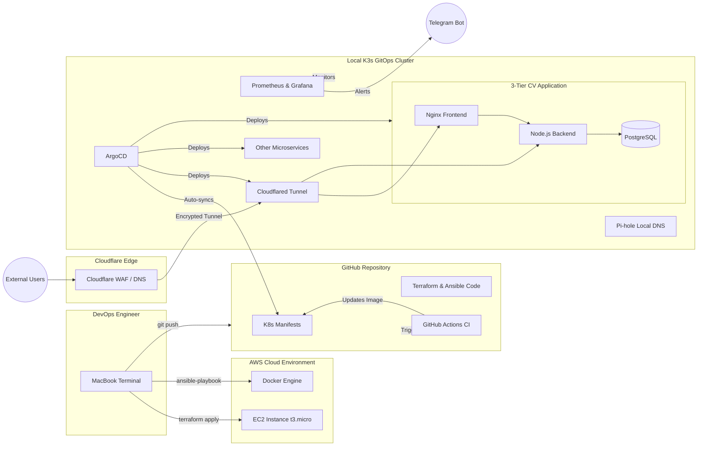

# ☁️ Hybrid Cloud DevOps Homelab & GitOps Automation


## 📌 Overview
A complete, production-style DevOps platform that combines a **local GitOps-managed K3s cluster** with **AWS cloud infrastructure** provisioned via Terraform and configured with Ansible. The repo is the single source of truth — every change to applications, infrastructure, or alerting flows through Git and is reconciled by ArgoCD.

**Live demo (exposed via Cloudflare Zero Trust, no public ingress):**
- [cv.batpepe.online](https://cv.batpepe.online) — Nginx-served CV & portfolio
- [game.batpepe.online](https://game.batpepe.online) — Batman browser game

## 🏗️ Architecture



## ✨ Key Features
- **Hybrid cloud** — local K3s for the GitOps platform, AWS EC2 for cloud workloads, both managed from one repo.
- **Pure GitOps** — `main` branch is the desired state; ArgoCD reconciles in both directions (`prune: true`, `selfHeal: true`).
- **Zero open inbound ports at home** — public traffic enters via a Cloudflare Tunnel terminated by `cloudflared` running in-cluster.
- **CI → CD handoff** — GitHub Actions builds images, scans them with Trivy, pushes to GHCR, and commits the new image digest back to the manifest; ArgoCD picks it up automatically.
- **Built-in observability** — kube-prometheus-stack ships Prometheus, Alertmanager, and Grafana; custom `PrometheusRule`s route firing alerts to Telegram.
- **Secret hygiene** — no secrets in Git. Postgres, Cloudflare tunnel token, Telegram bot token, and Grafana admin password are created manually as Kubernetes secrets.

## 🧱 Tech Stack
| Layer | Tools |
| --- | --- |
| IaC | Terraform (AWS provider) |
| Configuration | Ansible |
| Container runtime | Docker, containerd (K3s) |
| Orchestration | K3s (Kubernetes) |
| GitOps | ArgoCD |
| CI | GitHub Actions, Trivy, GHCR |
| Networking | Traefik (K3s default), Cloudflare Tunnel |
| Observability | Prometheus, Alertmanager, Grafana, Telegram |
| Data | PostgreSQL 15 (PVC-backed) |
| Apps | Nginx, Node.js, Flask, static HTML, Pi-hole, whoami |

## 📁 Repository Layout
```
.
├── terraform/                # AWS EC2 + security group + SSH key (IaC)
├── ansible/                  # Provisions Docker + Nginx on the EC2 host
├── apps/                     # Application source code & Dockerfiles
│   ├── nginx-app/            #   Static CV frontend
│   ├── nodejs-app/           #   API backend (Postgres-backed)
│   ├── flask-app/            #   Sample Flask service (used for alert demos)
│   └── batman-app/           #   Batman browser game
├── k8s-infrastructure/
│   ├── core/                 # Cluster-level objects (e.g. ArgoCD ingress)
│   ├── apps/                 # Manifests per workload (Deployment / Service / Ingress)
│   └── argocd-apps/          # ArgoCD Application CRs (the "App of Apps")
└── .github/workflows/        # CI pipelines (one per app)
```

## 🚀 Getting Started

### Prerequisites
- macOS or Linux workstation
- `terraform`, `ansible`, `kubectl`, `helm`, `argocd` CLIs
- A running K3s cluster (e.g. on a Raspberry Pi or local VM)
- AWS account + an SSH keypair at `~/.ssh/aws_ec2_key{,.pub}`
- A Cloudflare account with a Tunnel created (token in hand)

### 1. Provision the cloud host
```bash
cd terraform
cp terraform.tfvars.example terraform.tfvars   # add your /32 public IP
terraform init
terraform apply
terraform output server_public_ip              # paste into ansible/inventory.ini
```

### 2. Configure the cloud host
```bash
cd ../ansible
ansible-playbook -i inventory.ini setup-server.yml
```

### 3. Bootstrap ArgoCD on the homelab cluster
```bash
kubectl create namespace argocd
kubectl apply -n argocd -f https://raw.githubusercontent.com/argoproj/argo-cd/stable/manifests/install.yaml
kubectl apply -f k8s-infrastructure/core/argocd-ingress.yaml
```

### 4. Create the required secrets (never committed)
```bash
# Postgres credentials
kubectl create namespace apps
kubectl create secret generic postgres-secret -n apps \
  --from-literal=POSTGRES_USER=devops \
  --from-literal=POSTGRES_PASSWORD='<strong-password>' \
  --from-literal=POSTGRES_DB=homelab_db

# Cloudflare Tunnel token
kubectl create secret generic cloudflare-token -n apps \
  --from-literal=token='<cloudflared-tunnel-token>'

# Grafana admin password
kubectl create namespace monitoring
kubectl create secret generic grafana-admin-secret -n monitoring \
  --from-literal=admin-password='<grafana-admin-password>'

# Telegram alerting
kubectl create secret generic tg-secret -n monitoring \
  --from-literal=bottoken='<telegram-bot-token>' \
  --from-literal=chatid='<telegram-chat-id>'
```

### 5. Hand the cluster over to GitOps
```bash
kubectl apply -f k8s-infrastructure/argocd-apps/my-apps.yaml
kubectl apply -f k8s-infrastructure/argocd-apps/monitoring-stack.yaml
```
ArgoCD now owns every workload listed under `k8s-infrastructure/`.

## 🔁 CI/CD Flow
1. Developer pushes a change under `apps/<service>/**`.
2. The matching workflow in `.github/workflows/` builds a Docker image, tags it with the commit SHA, and pushes to **GHCR**.
3. **Trivy** scans the image for CRITICAL CVEs.
4. The workflow rewrites the `image:` field in the corresponding K8s manifest and commits the change back to `main`.
5. **ArgoCD** detects the manifest drift and rolls out the new image. Liveness/readiness probes gate the rollout.

## 📈 Observability & Alerting
- **kube-prometheus-stack** is installed as an ArgoCD Application that pins the chart version, so upgrades are explicit.
- Custom alerts live next to the workload they monitor (see `k8s-infrastructure/apps/flask/flask-alert.yaml`).
- Alertmanager routes firing alerts through a Grafana contact point to a Telegram bot using a custom HTML template — group by `alertname` + `namespace`, repeat every 10 minutes.

## 🛡️ Security
See [SECURITY.md](./SECURITY.md) for the threat model, secrets policy, and how to report a vulnerability.

## 🗺️ Roadmap
See [ROADMAP.md](./ROADMAP.md) for the prioritized DevOps backlog — quick wins, supply-chain hardening, observability, and policy-as-code items, each tagged with effort and value.

## 📜 License
This project is shared for educational and portfolio purposes. No license is granted beyond viewing the source; contact the author before reusing it in production.

## 👤 Author
**Kostiantyn Osmakov** — DevOps Engineer
- Portfolio: [cv.batpepe.online](https://cv.batpepe.online)
- GitHub: [@batpepe](https://github.com/batpepe)
